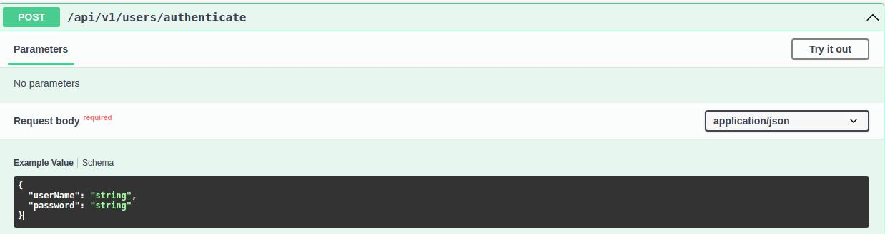
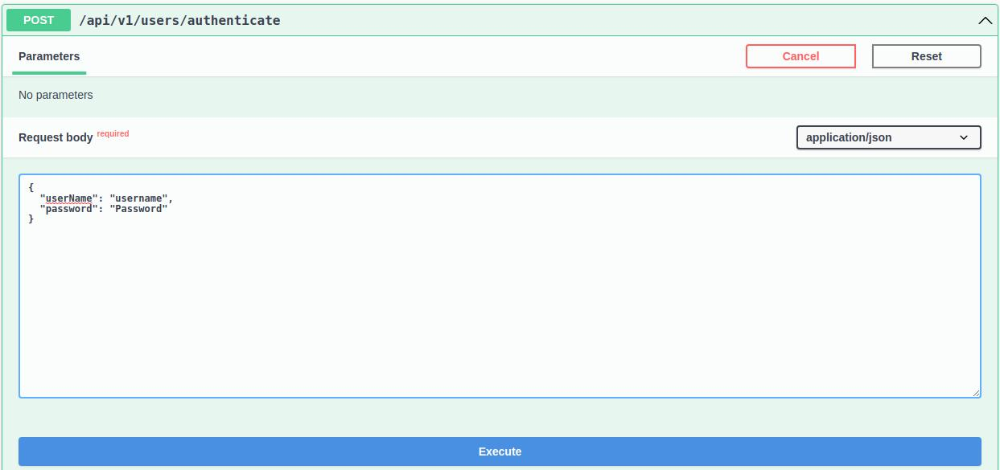
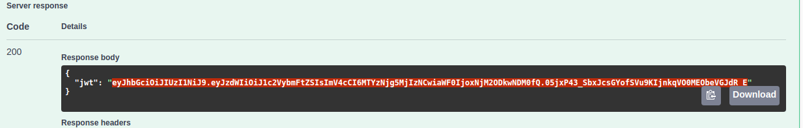
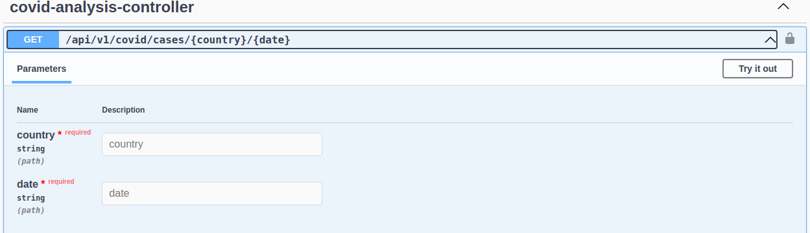
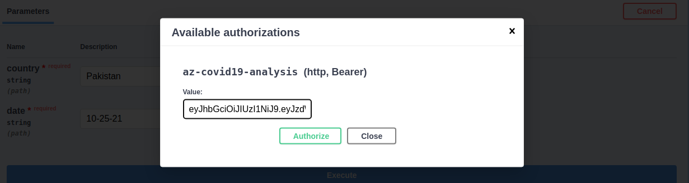
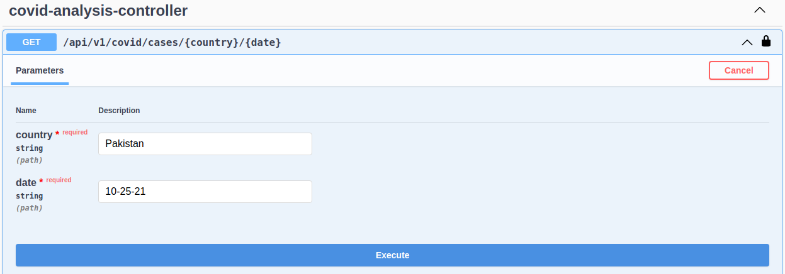
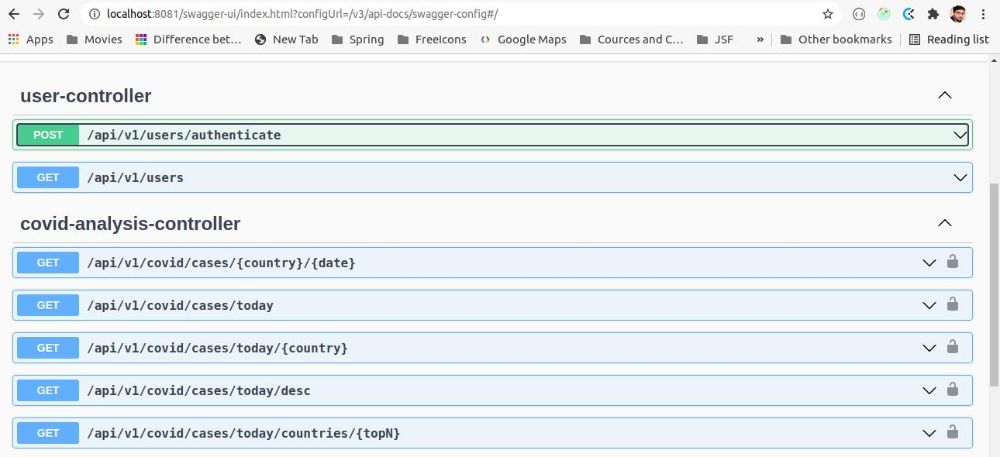
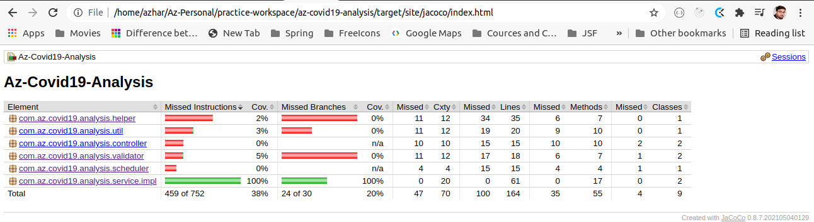

### Az-Covid19-Analysis-API
> REQUIREMENTS

Johns Hopkins University Center for Systems Science and Engineering (JHU CSSE) publishes data about Coronavirus COVID-19 impact on a daily basis.
Write a simple Spring Boot Restful service using a subset of that dataset (link
given below) exposing some restful endpoints (explained below) for analytical purposes.

The API should have a simple mock authentication/authorization mechanism using Spring
Security whereby a user first gets a JWT token by providing any username. Passing a
username again should invalidate the existing JWT token and return a new one. All other
endpoints should be secured and not accessible without a valid JWT token.

Do not create a database as data should be downloaded again daily (You can manage daily
updates as you like). You can use any supporting library for csv processing. Use global
confirmed cases dataset only.
Use the raw option on GitHub to download the csv data file.
##### 1. Dataset:
* [CSV file link](https://github.com/CSSEGISandData/COVID-19/blob/master/csse_covid_19_data/csse_covid_19_time_series/time_series_covid19_confirmed_global.csv)
* [CSV RAW file link](https://raw.githubusercontent.com/CSSEGISandData/COVID-19/master/csse_covid_19_data/csse_covid_19_time_series/time_series_covid19_confirmed_global.csv)
##### 2. Endpoints:
* To get a JWT token
* To get list of users currently accessing the api
* All new cases reported today
* All new cases reported today country wise (sorted by cases reported today descending) 
* All new cases reported today in a country
* All new cases reported since a date in a country (choose whatever format but explain that in readme file)
* Top N countries with most reported cases today
---
> TOOLS AND TECHNOLOGIES:
* Java 1.8
* Spring Boot 2.5.6
* Spring Security 2.5.6
* Spring Data JPA 2.5.6
* JsonWebToken 0.9.1
* H2 (In-Memory DB)
* SpringDoc-Openapi-UI 1.5.12
  * Swagger-UI 3.52.5
* OpenCSV 5.5.2
* Junit 5
* Maven
  * Maven plugin JaCoCo 0.8.7
  * Maven plugin Sonar 3.9.1.2184
  * dockerfile-maven-plugin 1.4.13
* Intellij IDEA
---

> API DESCRIPTION 
##### 1. For DB
* For providing list of user currently accessing the api we need to store users
* For invalidating the existing token and providing new one, we also we need to store each user JWT.
* Because of above requirements I used In-Memory DB (H2).
##### 2. For CSV
* JHU CSSE pushing data on daily basis but when I checked history of commits I saw mini two times they are updating CSV file.
* For that I decided to have a scheduler initially it will bring the CSV file locally and then every 6Hr it will replace the file with updated data.
##### 3. For Documentation
* For API documentation I have used [`SpringDoc`](https://springdoc.org/) It's using Open API 3.
* After running application please check [this link](http://localhost:8081/swagger-ui/index.html)
* It will explain very well about all the end points, Request, Response Java Objects along with Ready Rest Client
##### 4. How To Run:
* Run below command from project folder
```
./mvnw clean install spring-boot:run
```
* Or Run as Docker image
```
./mvnw package
```
```
docker run -p 8081:8081 az-covid19-analysis:0.0.1
```

---
##### 5. How To Use:
* Please visit [this link](http://localhost:8081/swagger-ui/index.html)
* First call `/api/v1/authenticate` API by providing any username/password.
* In the response you will get jwt token copy that token and pass to header Authorization as Bearer Token for `Covid Analysis API's`.
* Simplest way to use application is:
  * Click on `/api/v1/authenticate` API and then click on `Try it out` button [on top of right side].

  * Add username/password and click on execute button

  * Copy the jwt from response

  * Select any api from `Covid Analysis Controller`

  * Please click lock icon from top right side
  * Past here the copied JWT and click on `Authorize`, then please close the popup.

  * Now you can click on `Try it out` button and give required param and then execute. **Date Format is MM-dd-yy**

* Or simple click on lock icon and put `token` (without Bearer)


> RESOURCES




> Test Coverage Report




> FUTURE IMPROVEMENTS

Although it's completed with respect to above requirements, but we can have below improvement points:
* I think we should save CSV data into DB on daily basis, so we'll not lose data history
* We should use Apache connect [sink and source] and ignore scheduler.
* For `/api/users` we can have `ADMIN` role, so that only admin can access this endpoint.
* For `/api/users` we can handle pagination because if users exceed then api response will be slow.
* Unit test coverage at least 85% required. 